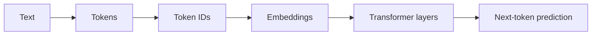

# Tokenization Notes

## Tokenization as a System Boundary

Tokenization is the first boundary in an LLM system.

Before retrieval, reasoning, summarization, or tool use, text is converted into tokens and then token IDs. That boundary changes how we should think about prompt size, document chunks, structured data, and context limits.

The important engineering point is not that every team needs to implement a tokenizer. The point is that every serious LLM system needs to measure and budget tokens.

## Words vs Tokens

Words are a human reading unit. Tokens are a model input unit.

Those two units overlap, but they are not the same. A common word may be one token. A rare word may be several tokens. Punctuation, whitespace patterns, numbers, code, and identifiers can change the count.

This is why "short" text can still be expensive in token terms.

## Subword Tokenization Intuition

Subword tokenization reuses common pieces.

Instead of storing every possible word, a tokenizer can represent text with reusable fragments. Common fragments reduce sequence length. Rare strings can still be represented by combining smaller pieces.

This is useful for open-ended language, but it means unusual formats can split more than expected.

The tokenizer in this repository uses a simple regex so the mechanics are easy to inspect. Production systems usually use optimized tokenizer libraries with learned vocabularies and model-specific behavior.

## Tokenization and Embeddings

After tokenization, token IDs are mapped to embeddings.

The model does not receive a Python string. It receives numeric IDs, which are converted into vectors. Those vectors become the sequence processed by transformer layers.

Tokenization therefore shapes the first representation the model sees.

## Tokenization and Next-Token Prediction

Language models are trained to predict tokens.

That means the unit of prediction is not necessarily a word. The model may predict punctuation, part of a word, a number, or a symbol. Understanding that helps explain why model output can appear one word at a time in some interfaces but is actually generated token by token.

## Tokenization and Context Windows

A context window is a token budget.

The total has to cover system instructions, developer messages, user input, chat history, retrieved context, tool results, expected output, and a safety margin. If one category grows, another category has less room.

Practical systems should reserve output tokens before packing retrieval context.

## Tokenization and RAG

RAG quality depends on what fits.

If chunks are too large, they can push out other useful evidence. If chunks are too small, they may lose local context. Character-based chunking is easy, but token-aware chunking is closer to the model's real constraint.

RAG pipelines should measure tokens at ingestion time and again when constructing final prompts.

## Tokenization and Structured Data

JSON, SQL, logs, tables, and stack traces can consume tokens quickly.

They contain punctuation, repeated keys, quotes, separators, long identifiers, and values that may not compress well. The data may look compact to a human and still occupy a large part of the context window.

For production systems, structured data should be trimmed, summarized, or transformed before it is packed into prompts.

## Tokenization and Agent Tool Output

Agent systems often add tool calls, tool results, traces, retrieved snippets, and intermediate state to the prompt.

That material can grow quietly. A single tool result may include JSON, logs, stack traces, or tables. If the system does not budget those tokens, the final prompt can crowd out the user request or the retrieved evidence that actually matters.

In agent workflows, token budgeting should include expected tool output, not only user-visible chat messages.

## Multimodal and Long-Context Notes

Tokenization is not only about plain text.

Multimodal models may represent images, audio, or video with their own units, such as patches, frames, or learned embeddings. Long-context models increase the available budget, but they do not remove the need to budget. More context can still mean more latency, higher cost, and more opportunities to pack irrelevant information.

The practical rule remains the same: measure what the model actually receives.

## Practical Engineering Rules

- Measure tokens early.
- Budget the context window.
- Chunk by tokens, not only characters.
- Reserve output tokens before packing retrieval context.
- Test using realistic user inputs.
- Watch JSON, SQL, logs, and tables carefully.
- Keep a safety margin for formatting and tool output variance.
- Treat tokenizer differences as model-specific behavior.
